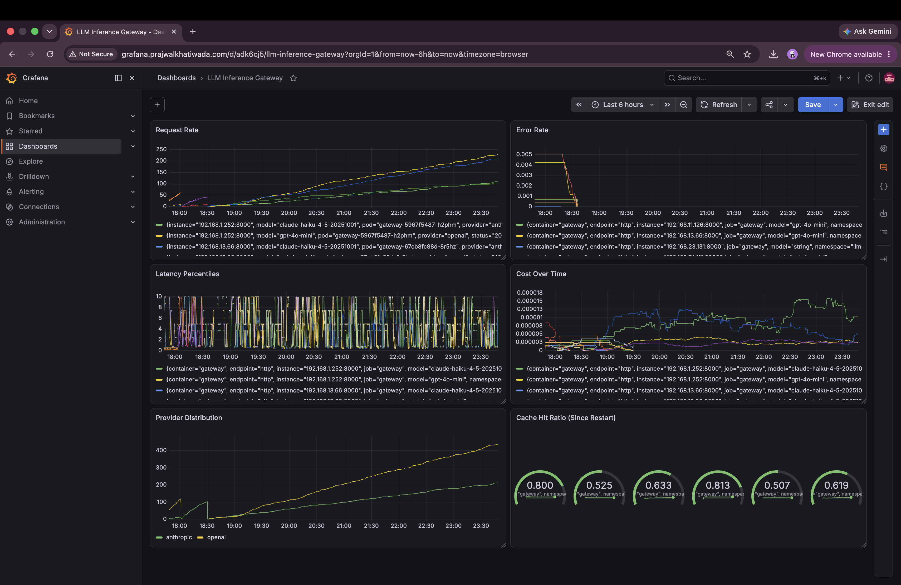

# LLM Inference Gateway

An API gateway that proxies requests to multiple LLM providers (OpenAI and Anthropic), with real auth, persistence, caching, rate limiting, cost tracking, smart routing, automatic failover, circuit breaking, and full observability. It is built as an OpenAI compatible drop-in endpoint.

**Live production deployment:** `https://gateway.prajwalkhatiwada.com`

## Why this exists

Single-provider LLM integrations break under provider outages and can't scale with traffic. This gateway sits in front of multiple providers, routes intelligently, fails over automatically when one goes down, and gives full visibility into cost and performance. It was deployed on real production infrastructure (AWS EKS) rather than only run locally.

## Features

- **Multi-provider abstraction** with automatic failover and per-provider circuit breaking
- **Real auth**: hashed API keys, admin-issued, never stored raw
- **Redis caching** and **atomic rate limiting**
- **Smart routing**: `"model": "auto"` resolves by prompt length
- **Cost tracking** and **usage accounting** per key, per day
- **Full observability**: Prometheus metrics, pre-built Grafana dashboard
- **Production-deployed** on Kubernetes (EKS), with HTTPS, autoscaling, and cluster-wide monitoring
- Tested against real infra (`testcontainers-python`), 82%+ coverage

## Tech stack

Python · FastAPI · PostgreSQL · Redis · AWS (EKS, RDS, EC2, Route 53, ACM, IAM) · Kubernetes · Helm · Prometheus · Grafana · Docker

## Documentation

- **[Local Setup](docs/local-setup.md)**: get this running on your machine in a few minutes with Docker Compose
- **[Production Deployment](docs/production-deployment.md)**: full AWS/EKS runbook, from a bare AWS account to a live HTTPS endpoint, with screenshots of the real deployed infrastructure
- **[API Reference](docs/api-reference.md)**: endpoints, auth flow, request/response examples
- **[Architecture](docs/architecture.md)**: request flow, data model, and the reasoning behind key design decisions

## Quick start

```bash
git clone https://github.com/Prajwaliscoding/llm-inference-gateway.git
cd llm-inference-gateway
docker compose up --build
```

Full first-run instructions, including creating your first API key, are in **[docs/local-setup.md](docs/local-setup.md)**.

## Production deployment at a glance

This gateway was deployed live to AWS EKS with a real domain, HTTPS, autoscaling, RDS Postgres, and full Prometheus/Grafana observability. The infrastructure was torn down after validation to avoid ongoing cost, but the full deployment process and results are documented with screenshots in **[docs/production-deployment.md](docs/production-deployment.md)**.



## Tests

```bash
make test
```

Real, throwaway Postgres + Redis containers via `testcontainers-python`; only external provider calls are mocked. Current coverage: **82%+**.

## Tooling

`uv` · `ruff` · `mypy` (strict) · Alembic · GitHub Actions CI · `eksctl` · Helm

## Author

Prajwal Khatiwada, CS Undergraduate, The University of Texas at Arlington
