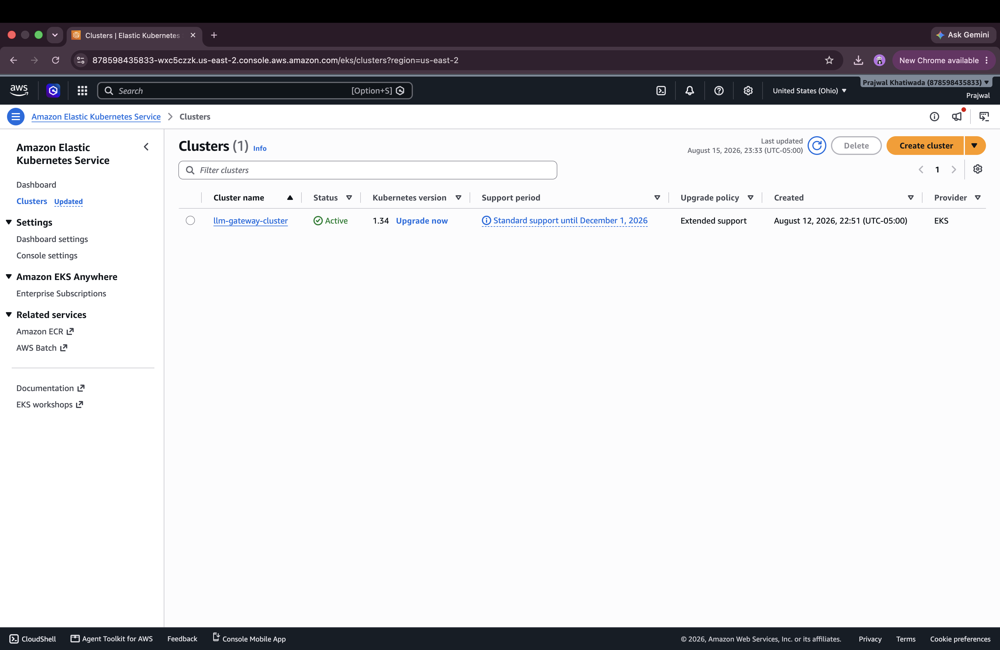
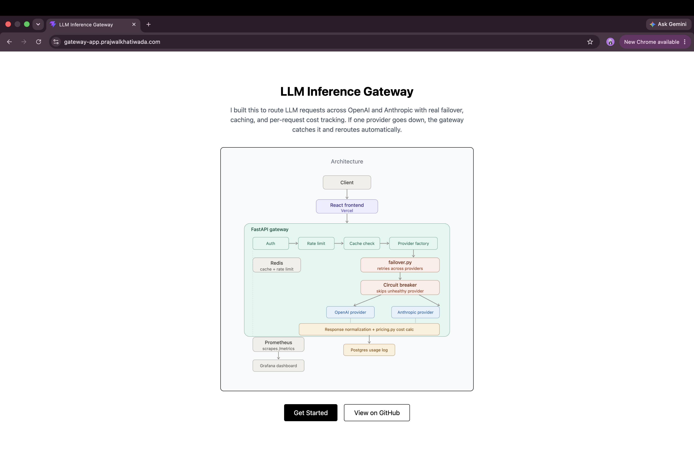
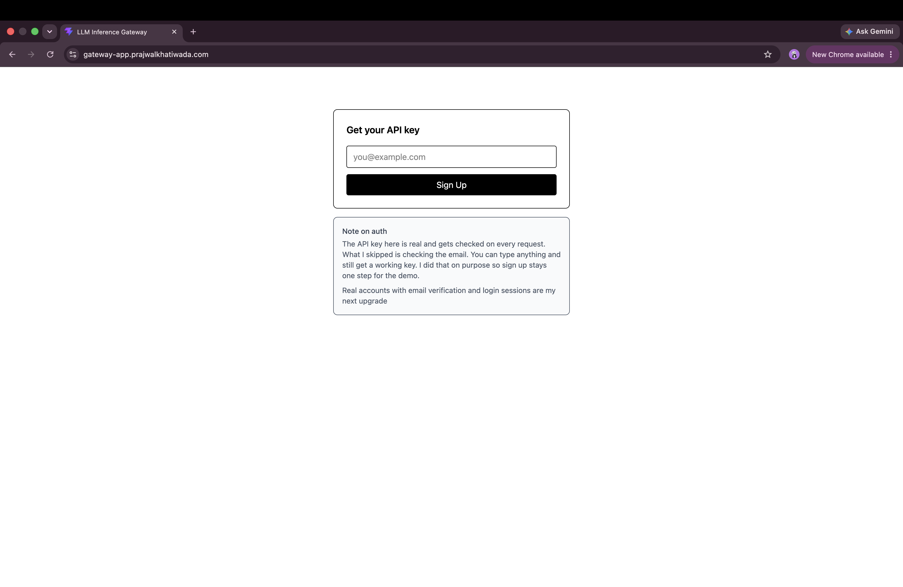
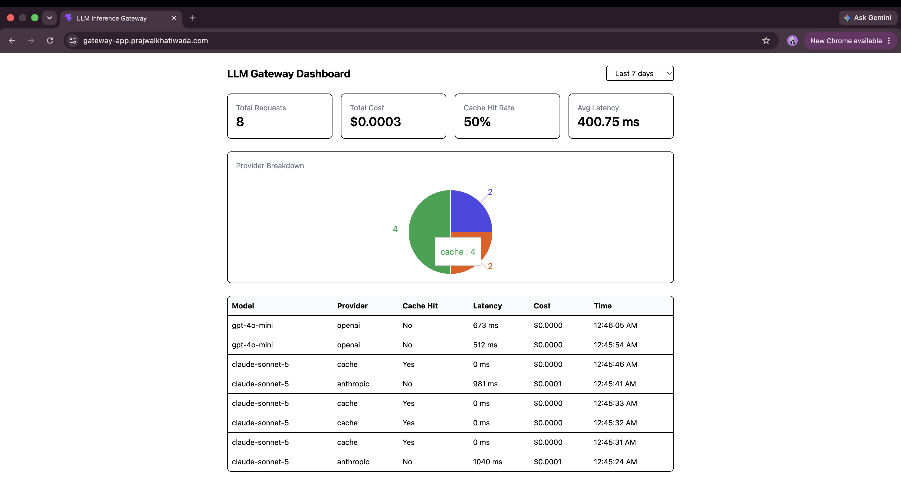
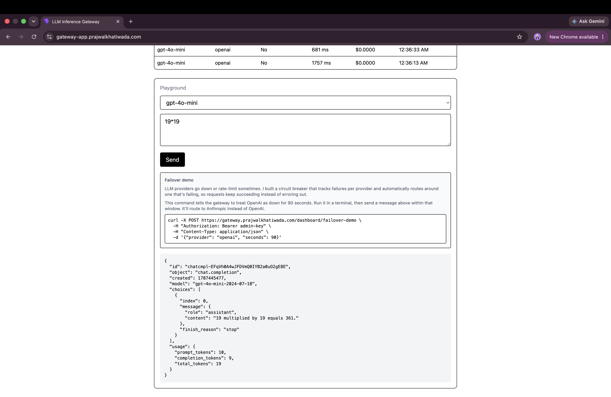

# Production Deployment (AWS EKS)

The gateway runs on Amazon EKS, with RDS Postgres, HTTPS on a custom domain, and cluster wide observability.

## Infrastructure

- **Cluster:** Amazon EKS, `eksctl`-provisioned, 2-node unmanaged node group
- **Ingress:** AWS Load Balancer Controller, provisioning an ALB
- **Database:** RDS Postgres, private subnets only, security-group-scoped to cluster nodes
- **Cache:** Redis, self-hosted in-cluster
- **Domain and TLS:** Route 53 plus an ACM certificate, HTTP redirects to HTTPS
- **Autoscaling:** HPA, 2 to 6 replicas on CPU
- **Access control:** IAM Roles for Service Accounts (IRSA), no static AWS credentials in the cluster
- **Observability:** `kube-prometheus-stack` via Helm, custom `ServiceMonitor`, Grafana public via its own Ingress
- **Frontend:** React app on Vercel, separate from the AWS infrastructure




## Frontend

Deployed on Vercel, always live at `https://gateway-app.prajwalkhatiwada.com`.









## Database

RDS Postgres is not publicly accessible from the open internet; migrations run from a pod inside the cluster rather than a developer laptop.


## HTTPS


## Observability


## Load testing

Benchmarked with [k6](https://k6.io) against the live deployment.

|     | Cache hit | Live provider call |
| --- | --------- | ------------------ |
| p50 | 56ms      | 550ms              |
| p90 | 66ms      | 945ms              |
| p95 | 96ms      | 1.03s              |

Scripts in `scripts/load-test-cached.js` and `scripts/load-test-live.js`.

A separate, continuous traffic generator ran on a dedicated EC2 instance to keep the Grafana dashboard populated with realistic ongoing traffic.


## Failover, demonstrated on demand

```bash
curl -X POST https://gateway.prajwalkhatiwada.com/dashboard/failover-demo \
  -H "Authorization: Bearer <admin-token>" \
  -H "Content-Type: application/json" \
  -d '{"provider": "openai", "seconds": 90}'
```

A request sent to an OpenAI-routed model within that window returns a response from Anthropic instead.


## Rebuilding this deployment

Infrastructure is torn down between deployments to control cost. To bring it back up:

1. Restore RDS from the latest snapshot
2. Recreate the EKS cluster with `eksctl create cluster -f infra/eksctl-cluster.yaml`
3. Install the AWS Load Balancer Controller
4. Apply the Kubernetes manifests in `k8s/`
5. Update the Route 53 record to point at the new ALB
6. Run `alembic upgrade head` against the restored database
7. Verify with `curl https://gateway.prajwalkhatiwada.com/health`

If the new cluster lands in a different VPC than RDS, they won't be able to reach each other by default. VPC peering, matching routes in both VPCs' route tables, and a security group rule allowing the cluster's node security group into RDS resolves that. RDS's DNS name resolves to its public IP from a peered VPC rather than its private IP, so a Route 53 private hosted zone pointing at the private IP directly is used instead of the public hostname or a hardcoded IP.

---

Back to **[README](../README.md)**.
