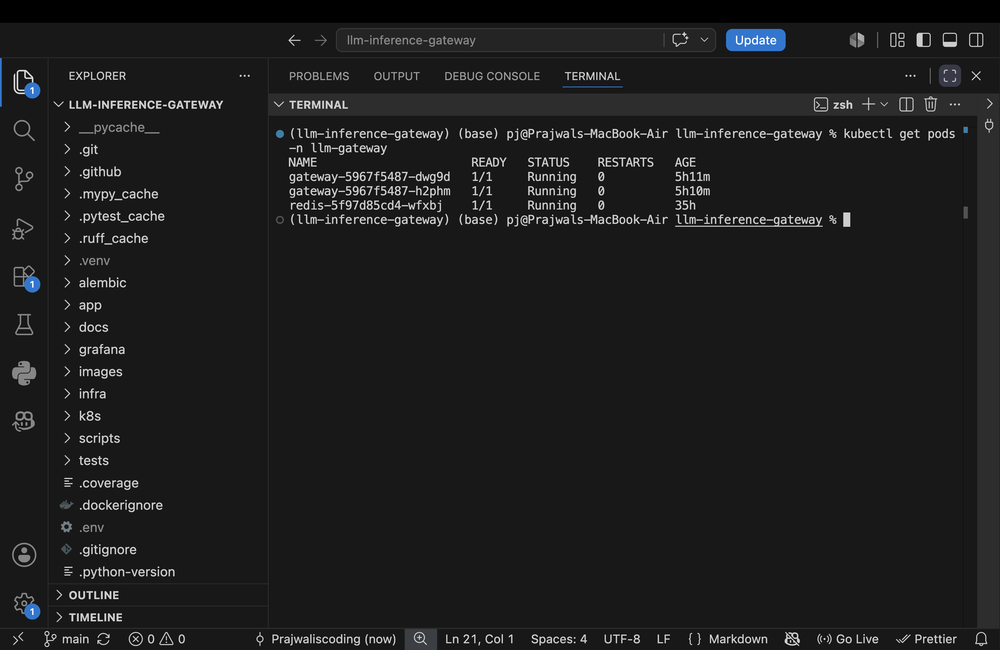
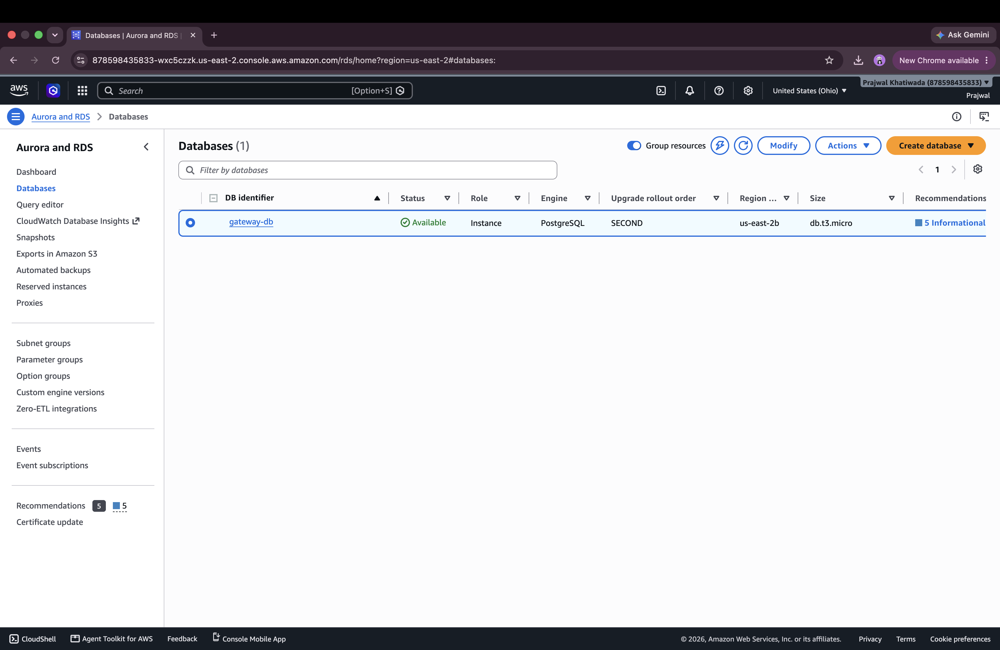
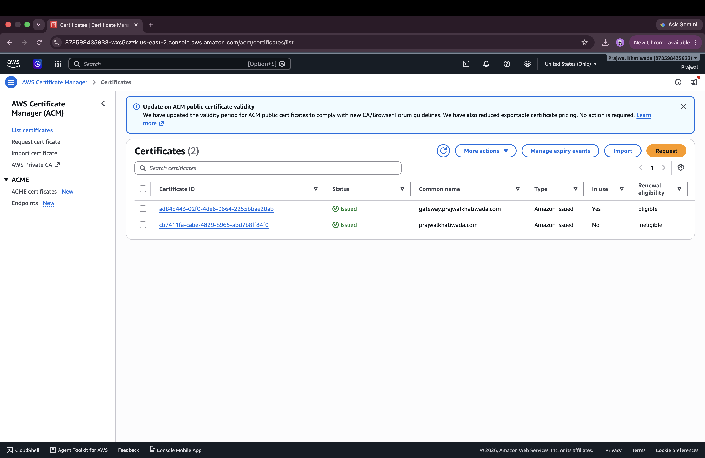
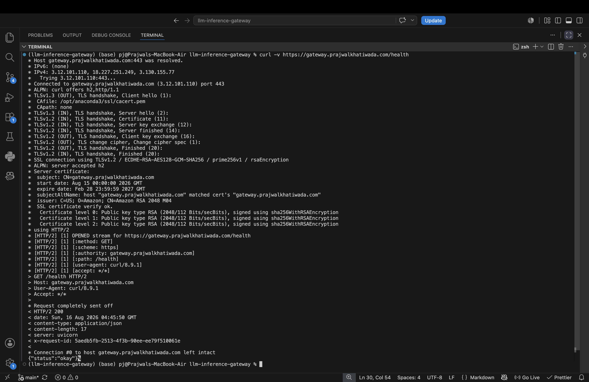
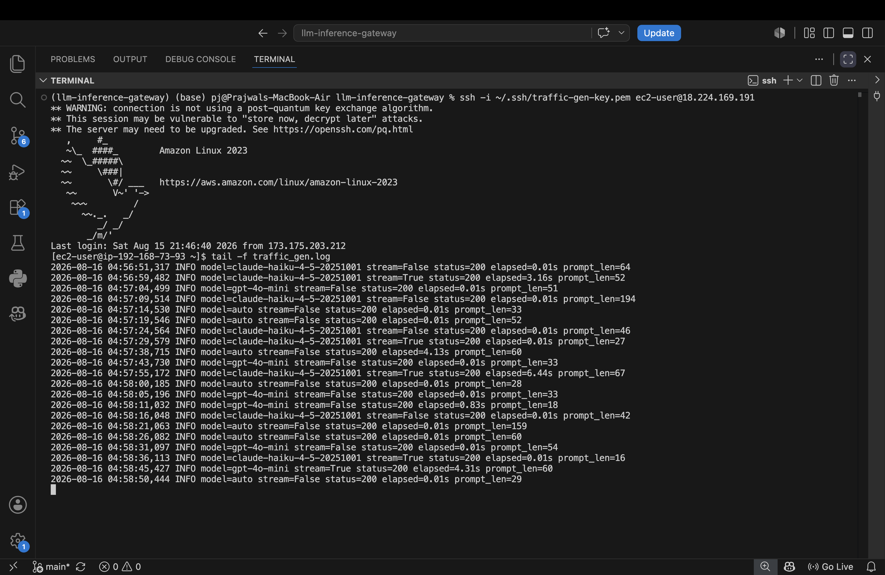
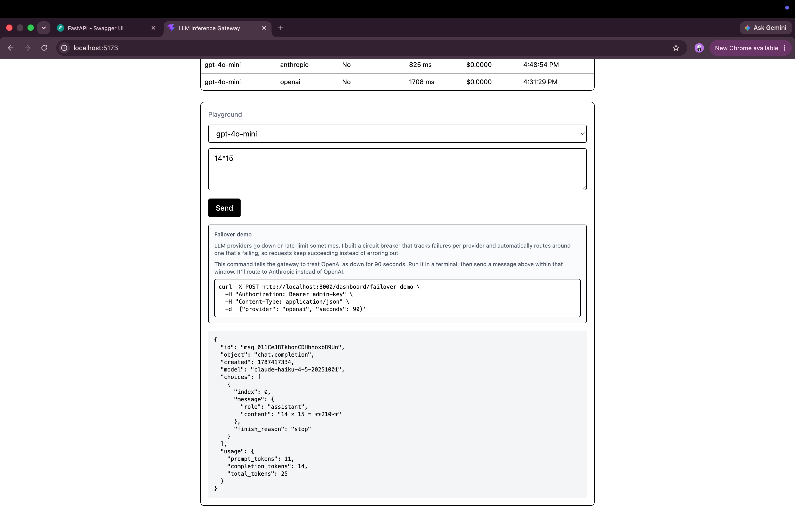
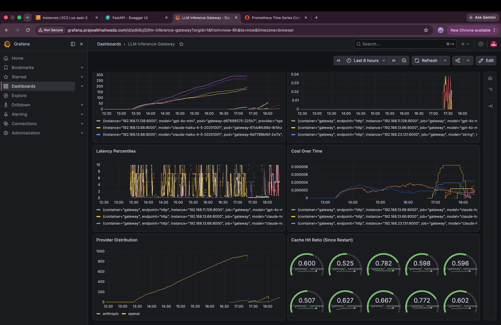

# Production Deployment (AWS EKS)

The gateway was deployed to a real AWS environment: EKS cluster, RDS Postgres, HTTPS on a custom domain, and cluster-wide observability. Infrastructure was torn down after validation to avoid ongoing cost; this document is the permanent record.

## Infrastructure

- **Cluster:** Amazon EKS, `eksctl`-provisioned, 2-node managed node group
- **Ingress:** AWS Load Balancer Controller, provisioning an ALB
- **Database:** RDS Postgres, private subnets only, security-group-scoped to cluster nodes
- **Cache:** Redis, self-hosted in-cluster
- **Domain & TLS:** Route 53 + ACM certificate, HTTP redirects to HTTPS
- **Autoscaling:** HPA, 2–6 replicas on CPU
- **Access control:** IAM Roles for Service Accounts (IRSA), no static AWS credentials in the cluster
- **Observability:** `kube-prometheus-stack` via Helm, custom `ServiceMonitor`, Grafana public via its own Ingress

## Database

RDS Postgres is not publicly accessible; migrations run from a pod inside the cluster rather than a developer laptop, keeping the database's attack surface minimal.

## HTTPS

## Observability

The same Grafana dashboard used locally (`grafana/dashboard.json`) was imported into this cluster's Grafana and populated with real traffic.

## Load testing

A continuous traffic generator ran on a dedicated EC2 instance: 100+ varied prompts, mixed cached/unique requests, mixed streaming, mixed `"auto"`/explicit model selection.

## Failover verification

Automatic provider failover was tested live: one provider's credentials were invalidated, and the gateway's fallback behavior was confirmed via a successful response and a visible shift in Grafana's Provider Distribution panel.

---

Back to **[README](../README.md)**.
